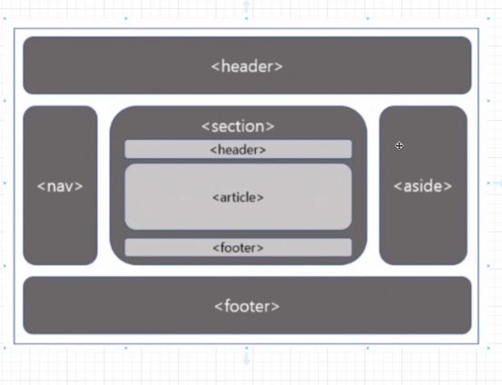

# 1주차 스터디

# 핵심 키워드 🎯

- **HTML(Hyper Text Markup Language**
    
    
    - **정의**
        
        웹페이지가 어떻게 구조화되어 있는지 브라우저로 하여금 알 수 있도록 하는 **마크업 언어 (프로그래밍 언어 X)**
        
    - **구조**
        - 일반 태그
            
            
            
        - self closing 태그
            
            
            

- **HTML 구조**
    
    
    
    

# 1주차 수업 후기 📢

- **수업을 듣고 서로 느낀 점을 이야기해주세요!**
    
    
    - **산도님**
        
        h1 ~ h6 : 글자 크기 때문에 이를 달리 쓰는 것은 좋은 방법이 아니다. 
        
        → 폰트 크기는 추후에 배울 css에서 조절할 수 있기 때문
        
    - **토리님**
        
        개발자도구를 통해서 기존 사이트의 요소들을 적극 활용할 수 있다는 점을 깨달았다.
        
    - **한니님**
        
        video, img 등 self closing tag의 존재에 대해 알게 되었고, 마찬가지로 개발자도구를 활용하는 점이 크게 와닿았다.
        
    - **어월두님**
        
        sementic : div 의 남발되는 단점을 보완하고자 ‘각 영역별 역할’들을 더한 태그, sementic tag에 대해 더 알아보고 싶다.
        
        개발자도구를 통해 여러 웹페이지의 구조를 파악해보고, 직접 클론 연습을 해보며 tag들을 저절로 익히는 연습을 해야겠다.
        
    
- **핵심 키워드에 대해 완벽하게 이해했는지? 혹시 이해가 안 되는 부분은 뭐였는지?
서로 이야기해주세요!**
    
    
    - sementic tag의 역할이 명확히 무엇인가?
        
        
        
        
        웹페이지를 깔끔하게 구성하기 위해서는 layout이 필수적이다. 
        layout을 구성할 때 사용하는 tag가 바로 div tag인데, 이는 위치나 역할 구분 없이 말 그대로 부분을 쪼개는 역할을 수행한다. 그래서 남발되기 쉬운  단점이 있어 이를 보완하기 위해 sementic tag가 등장했다.
        위 그림처럼 sementic은 **div에 각 영역별 역할들을 더한 tag**라고 이해하였다.
        

## **🌍 Naver main page를 대상 아래 세가지 진행해보기**

- 한 사이트에서 html의 구조 파악해보기
- html의 중요 태그들 살펴보기
- html의 역할 알아보기